---
## Front matter
title: "Отчёт по лабораторной работе 6"
subtitle: "Архитектура компьютера"
author: "Довран Илиев"

## Generic otions
lang: ru-RU
toc-title: "Содержание"

## Bibliography
bibliography: bib/cite.bib
csl: pandoc/csl/gost-r-7-0-5-2008-numeric.csl

## Pdf output format
toc: true # Table of contents
toc-depth: 2
lof: true # List of figures
lot: true # List of tables
fontsize: 12pt
linestretch: 1.5
papersize: a4
documentclass: scrreprt
## I18n polyglossia
polyglossia-lang:
  name: russian
  options:
	- spelling=modern
	- babelshorthands=true
polyglossia-otherlangs:
  name: english
## I18n babel
babel-lang: russian
babel-otherlangs: english
## Fonts
mainfont: PT Serif
romanfont: PT Serif
sansfont: PT Sans
monofont: PT Mono
mainfontoptions: Ligatures=TeX
romanfontoptions: Ligatures=TeX
sansfontoptions: Ligatures=TeX,Scale=MatchLowercase
monofontoptions: Scale=MatchLowercase,Scale=0.9
## Biblatex
biblatex: true
biblio-style: "gost-numeric"
biblatexoptions:
  - parentracker=true
  - backend=biber
  - hyperref=auto
  - language=auto
  - autolang=other*
  - citestyle=gost-numeric
## Pandoc-crossref LaTeX customization
figureTitle: "Рис."
tableTitle: "Таблица"
listingTitle: "Листинг"
lofTitle: "Список иллюстраций"
lotTitle: "Список таблиц"
lolTitle: "Листинги"
## Misc options
indent: true
header-includes:
  - \usepackage{indentfirst}
  - \usepackage{float} # keep figures where there are in the text
  - \floatplacement{figure}{H} # keep figures where there are in the text
---

# Цель работы

Целью работы является освоение арифметических инструкций языка ассемблера NASM.

# Выполнение лабораторной работы

1. Установил директорию для файлов лабораторного занятия № 6, переместился в эту директорию и создал файл с именем lab6-1.asm.

2. Проанализируем примеры программ, которые осуществляют вывод символов и чисел. Эти программы будут отображать данные, помещенные в регистр eax.

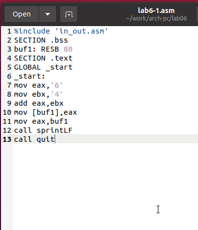{ #fig:001 width=70%, height=70% }

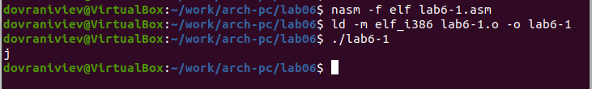{ #fig:002 width=70%, height=70% }

3. Затем модифицирую код программы, подставляя числа вместо символов в регистры.

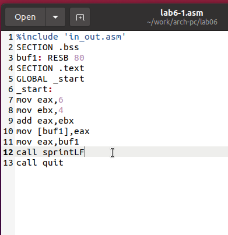{ #fig:003 width=70%, height=70% }

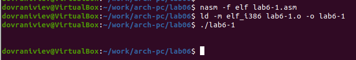{ #fig:004 width=70%, height=70% }

Хотя символ не отображается на экране, он присутствует. Это символ перевода строки LF.

4. Как упоминалось ранее, для манипуляций с числами в файле in_out.asm предусмотрены специальные подпрограммы, которые преобразуют ASCII символы в числовые значения и наоборот.
Применил эти функции для преобразования кода программы

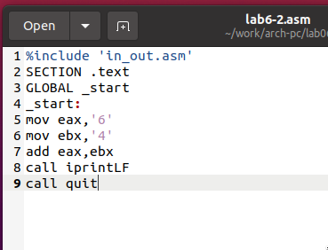{ #fig:005 width=70%, height=70% }

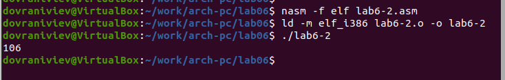{ #fig:006 width=70%, height=70% }

В результате выполнения программы получаем значение 106. В этом случае, как и в первом примере, команда add суммирует коды символов '6' и '4' (54+52=106). Но в этот раз, в отличие от предыдущей программы, функция iprintLF позволяет отобразить число, а не символ, ASCII код которого соответствует этому числу.

5. Подобно предшествующему случаю, произведем замену символов на числовые значения.

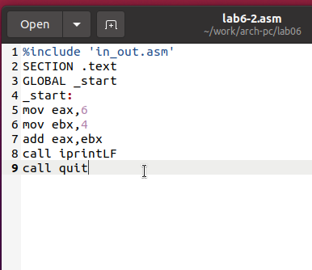{ #fig:007 width=70%, height=70% }

Функция iprintLF дает возможность отобразить число, при этом операнды были числами, а не ASCII кодами символов. Таким образом, результатом является число 10.

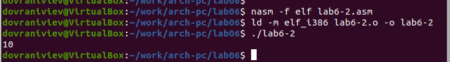{ #fig:008 width=70%, height=70% }

Замена функции iprintLF на iprint приводит к изменению вывода: отсутствует перевод строки.

{ #fig:009 width=70%, height=70% }

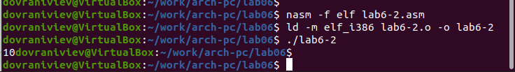{ #fig:010 width=70%, height=70% }

6. В качестве иллюстрации выполнения арифметических операций в NASM представим программу, которая вычисляет арифметическое выражение 
$$f(x) = (5 * 2 + 3)/3$$.

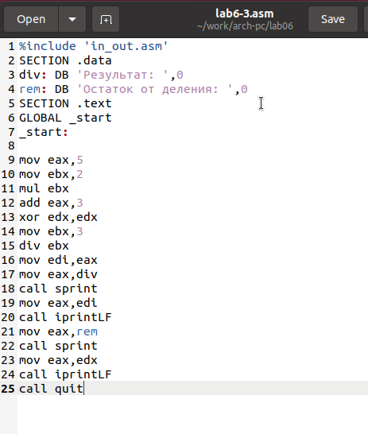{ #fig:011 width=70%, height=70% }

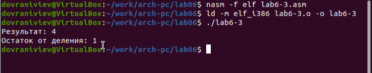{ #fig:012 width=70%, height=70% }

Адаптировал код программы для расчета формулы 
$$f(x) = (4 * 6 + 2)/5$$. 
Скомпилировал исполняемый файл и осуществил его тестирование.

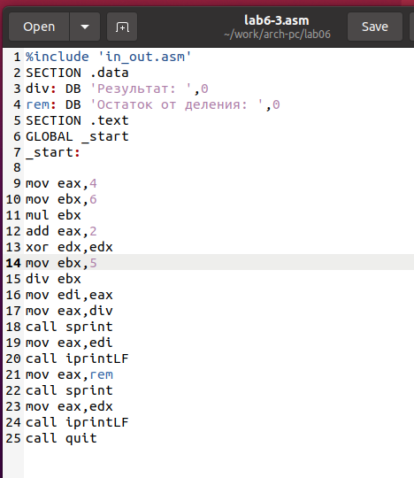{ #fig:013 width=70%, height=70% }

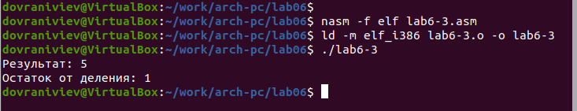{ #fig:014 width=70%, height=70% }

7. В качестве альтернативного примера рассмотрим программу, которая выполняет расчет заданного варианта исходя из номера студенческого билета.

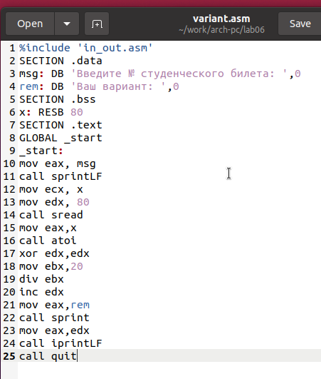{ #fig:015 width=70%, height=70% }

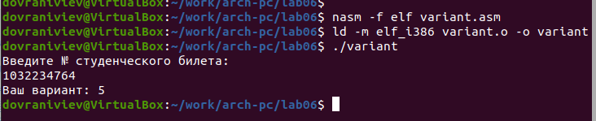{ #fig:016 width=70%, height=70% }

ответы на вопросы

1. Какие строки листинга отвечают за вывод на экран сообщения ‘Ваш вариант:’?

Значение с текстом 'Ваш вариант:' загружается в регистр eax с помощью команды mov eax,rem.

Для вывода указанной строки на экран используется команда call sprint, которая инициирует соответствующую функцию.

2. Для чего используется следующие инструкции?

mov ecx, x 
mov edx, 80 
call sread

Значение переменной X копируется в регистр ecx с помощью команды mov ecx, x.

Команда mov edx, 80 задаёт число 80 в регистре edx.

Вызов функции чтения с консоли осуществляется командой call sread.

3. Для чего используется инструкция “call atoi”?

Вызов "call atoi" инициирует функцию, конвертирующую строковые данные в целочисленный формат.

4. Какие строки листинга отвечают за вычисления варианта?

Обнуление регистра edx достигается командой xor edx,edx.

Установка числа 20 в регистр ebx осуществляется командой mov ebx,20.

Деление числа студенческого билета на 20 производится командой div ebx.

Последующее увеличение содержимого регистра edx на единицу выполняется командой inc edx.

5. В какой регистр записывается остаток от деления при выполнении инструкции “div ebx”?

Регистр edx используется для хранения остатка от деления при выполнении команды div ebx.

6. Для чего используется инструкция “inc edx”?

Команда inc edx служит для инкрементирования содержимого регистра edx на один. Это необходимо для корректировки результата вычисления варианта, учитывая прибавление единицы к остатку от деления.

7. Какие строки листинга отвечают за вывод на экран результата вычислений? 

Для передачи результата расчётов в регистр eax используется команда mov eax,edx.

Для вывода результата на экран применяется команда call iprintLF, активирующая соответствующую функцию.

8. Написать программу вычисления выражения y = f(x). Программа должна выводить выражение 
для вычисления, выводить запрос на ввод значения x, 
вычислять заданное выражение в зависимости от введенного x, выводить результат вычислений. 
Вид функции f(x) выбрать из таблицы 6.3 вариантов заданий в соответствии с номером 
полученным при выполнении лабораторной работы. 
Создайте исполняемый файл и проверьте его работу для значений x1 и x2 из 6.3.

Получили вариант 5 - $$(9x - 8)/8$$  для $$x=8, x=64$$

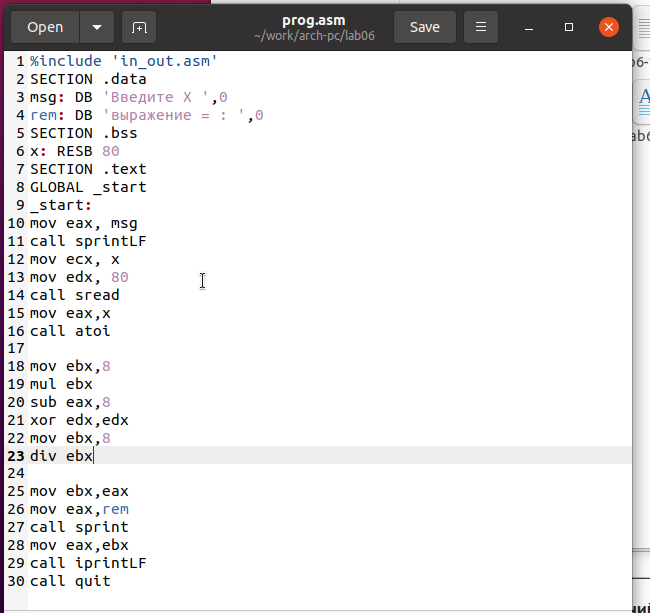{ #fig:017 width=70%, height=70% }

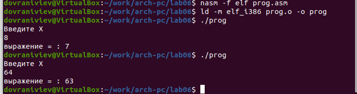{ #fig:018 width=70%, height=70% }

# Выводы

Изучили работу с арифметическими операциями.