---
## Front matter
title: "Отчёт по лабораторной работе 7"
subtitle: "Архитектура компьютера"
author: "Довран Илиев"

## Generic otions
lang: ru-RU
toc-title: "Содержание"

## Bibliography
bibliography: bib/cite.bib
csl: pandoc/csl/gost-r-7-0-5-2008-numeric.csl

## Pdf output format
toc: true # Table of contents
toc-depth: 2
lof: true # List of figures
lot: true # List of tables
fontsize: 12pt
linestretch: 1.5
papersize: a4
documentclass: scrreprt
## I18n polyglossia
polyglossia-lang:
  name: russian
  options:
	- spelling=modern
	- babelshorthands=true
polyglossia-otherlangs:
  name: english
## I18n babel
babel-lang: russian
babel-otherlangs: english
## Fonts
mainfont: PT Serif
romanfont: PT Serif
sansfont: PT Sans
monofont: PT Mono
mainfontoptions: Ligatures=TeX
romanfontoptions: Ligatures=TeX
sansfontoptions: Ligatures=TeX,Scale=MatchLowercase
monofontoptions: Scale=MatchLowercase,Scale=0.9
## Biblatex
biblatex: true
biblio-style: "gost-numeric"
biblatexoptions:
  - parentracker=true
  - backend=biber
  - hyperref=auto
  - language=auto
  - autolang=other*
  - citestyle=gost-numeric
## Pandoc-crossref LaTeX customization
figureTitle: "Рис."
tableTitle: "Таблица"
listingTitle: "Листинг"
lofTitle: "Список иллюстраций"
lotTitle: "Список таблиц"
lolTitle: "Листинги"
## Misc options
indent: true
header-includes:
  - \usepackage{indentfirst}
  - \usepackage{float} # keep figures where there are in the text
  - \floatplacement{figure}{H} # keep figures where there are in the text
---

# Цель работы

Целью работы является изучение команд условного и безусловного переходов. Приобретение навыков написания программ с использованием переходов. Знакомство с назначением и структурой файла листинга.

# Выполнение лабораторной работы

1. Сформировал папку для хранения программ лабораторной работы № 7 и создал файл lab7-1.asm в ней

2. Команда jmp в ассемблере NASM применяется для выполнения безусловного перехода. Проанализируем код, демонстрирующий использование команды jmp.

Внёс текст программы, соответствующий листингу 7.1, в файл lab7-1.asm.

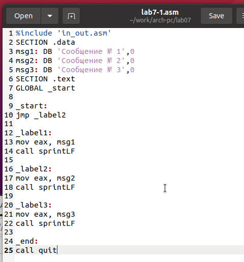{ #fig:001 width=70%, height=70% }

Скомпилировал программу, получил исполняемый файл и осуществил его запуск.

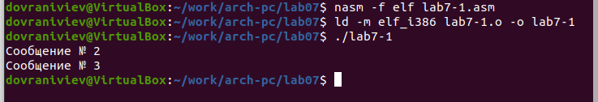{ #fig:002 width=70%, height=70% }

Команда jmp дает возможность совершать переход как вперёд, так и назад по коду. 
Модифицируем программу так, чтобы она сначала отобразила ‘Сообщение № 2’, затем ‘Сообщение № 1’ и после этого завершила выполнение. 
Для достижения этого после демонстрации сообщения № 2 добавим команду jmp с меткой _label1 
(что означает переход к командам, выводящим сообщение № 1), и после сообщения № 1 вставим команду jmp с меткой _end 
(что означает переход к команде call quit).

Произвёл изменения в коде программы в соответствии с листингом 7.2.

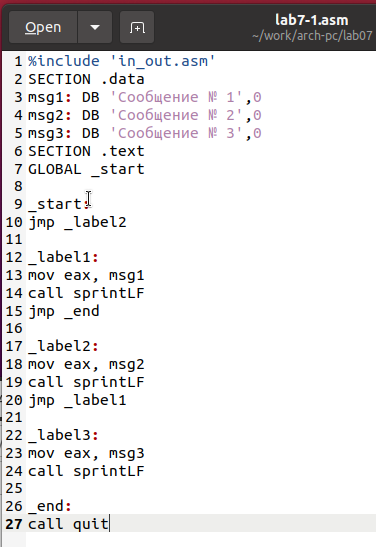{ #fig:003 width=70%, height=70% }

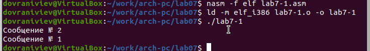{ #fig:004 width=70%, height=70% }

Исправил код программы, скорректировав команды jmp для достижения следующего порядка вывода информации:
```
Сообщение № 3
Сообщение № 2
Сообщение № 1
```

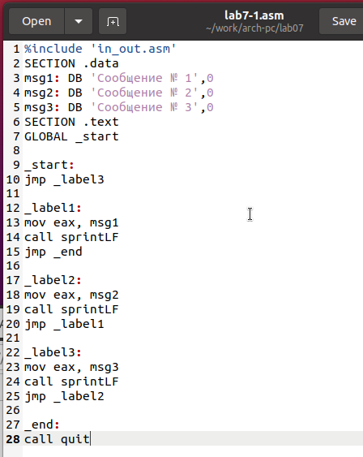{ #fig:005 width=70%, height=70% }

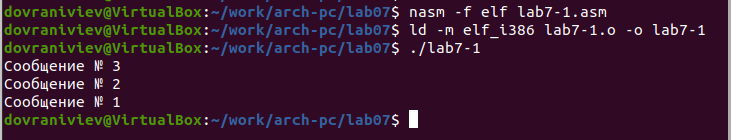{ #fig:006 width=70%, height=70% }

3. Применение команды jmp всегда ведёт к совершению перехода. 
Однако, в процессе программирования часто возникает потребность в условных переходах, 
когда переход осуществляется только при выполнении определённого условия. 
В качестве примера возьмём программу, которая определяет и показывает на экране максимальное число из трёх целочисленных переменных: A, B и C. 
Значения A и C заданы в коде программы, а значение B вводится пользователем с клавиатуры.

Скомпилировал программу и осуществил проверку её работы с различными значениями B.

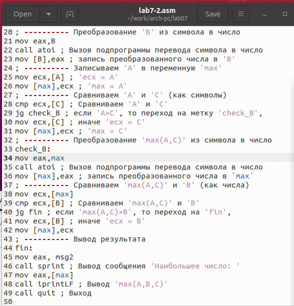{ #fig:007 width=70%, height=70% }

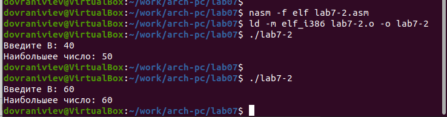{ #fig:008 width=70%, height=70% }

4. В обычном режиме nasm генерирует только объектный файл после ассемблирования. 
Чтобы создать файл листинга, необходимо использовать ключ -l и указать имя файла листинга в командной строке.

Сгенерировал файл листинга для программы, расположенной в файле lab7-2.asm.

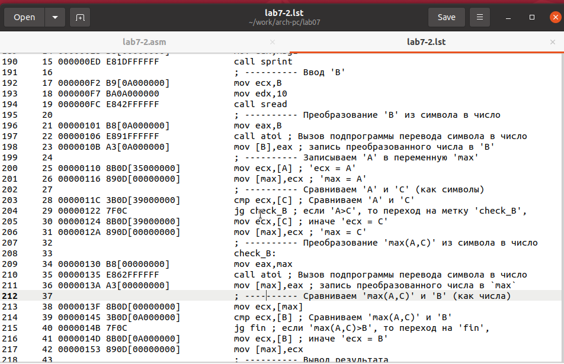{ #fig:009 width=70%, height=70% }

Внимательно ознакомился с его форматом и содержимым. 
Подробно объясню содержимое трёх строк файла листинга по выбору.

*строка 23*

* 23 - номер строки

* 0000010B - адрес

* A3[0A000000]  - машинный код

* mov [B],eax - код программы

*строка 25*

* 25 - номер строки

* 00000110 - адрес

* 8B0D[35000000] - машинный код

* mov ecx,[A]- код программы

*строка 26*

* 26 - номер строки

* 00000116 - адрес

* 890D[00000000] - машинный код

* mov [max],ecx - код программы

Открыл исходный файл программы lab7-2.asm и удалил один из операндов в инструкции с двумя операндами. 
Затем провёл ассемблирование, получив файл листинга.

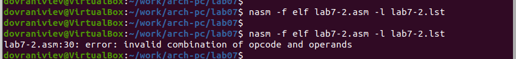{ #fig:010 width=70%, height=70% }

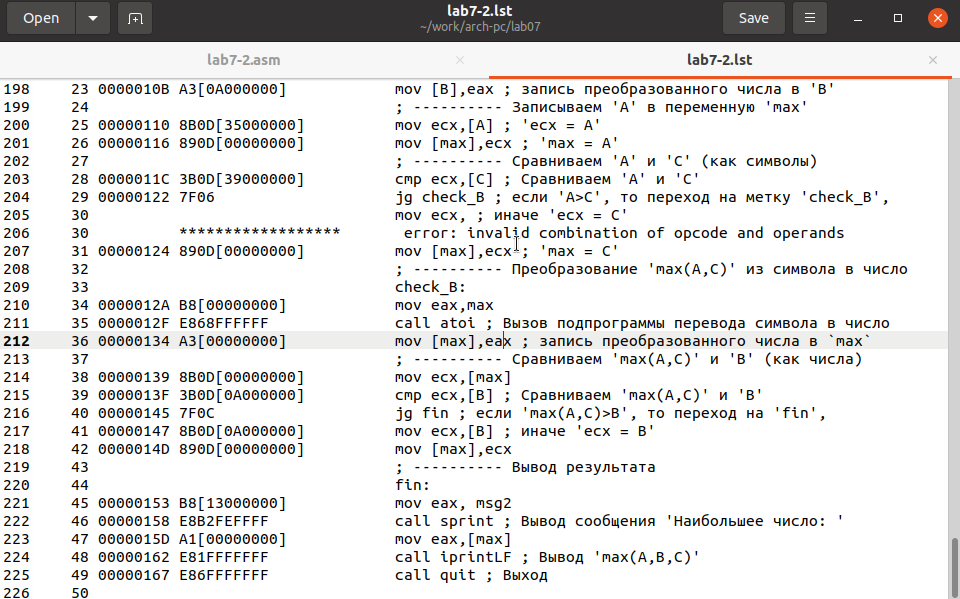{ #fig:011 width=70%, height=70% }

Объектный файл не смог создаться из-за ошибки. Но получился листинг, где выделено место ошибки.

5. Напишите программу нахождения наименьшей из 3 целочисленных переменных a,b и c. 
Значения переменных выбрать из табл. 7.5 в соответствии с вариантом, полученным при выполнении лабораторной работы № 6.
Создайте исполняемый файл и проверьте его работу

для варианта 5 - 54,62,87

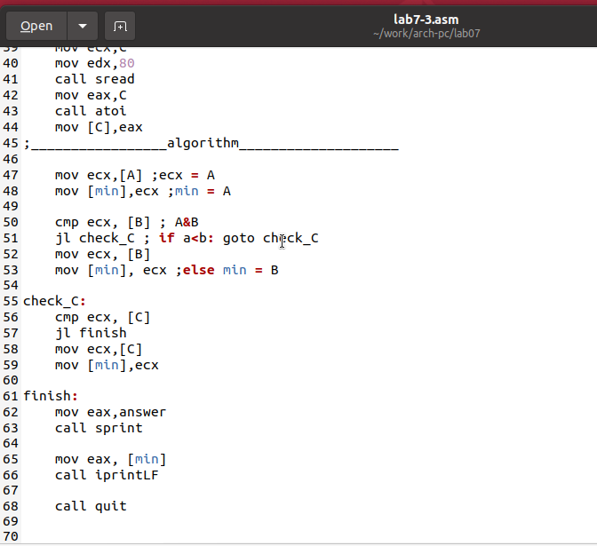{ #fig:012 width=70%, height=70% }

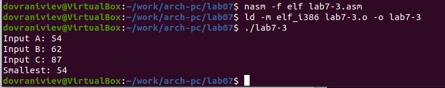{ #fig:013 width=70%, height=70% }

6. Напишите программу, которая для введенных с клавиатуры значений x и a вычисляет значение заданной функции f(x) и выводит результат вычислений. 
Вид функции f(x) выбрать из таблицы 7.6 вариантов заданий в соответствии с вариантом, полученным при выполнении лабораторной работы № 7. 
Создайте исполняемый файл и проверьте его работу для значений X и a из 7.6.

для варианта 5

$$
 \begin{cases}
	(2x-a), x > a
	\\   
	15, x \le a
 \end{cases}
$$

{ #fig:014 width=70%, height=70% }

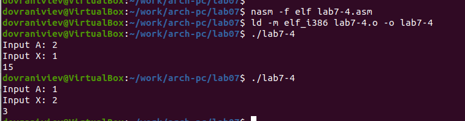{ #fig:015 width=70%, height=70% }

# Выводы

Изучили команды условного и безусловного переходов, познакомились с фалом листинга.