---
## Front matter
title: "Отчёт по лабораторной работе 9"
subtitle: "Архитектура компьютера"
author: "Довран Илиев"

## Generic otions
lang: ru-RU
toc-title: "Содержание"

## Bibliography
bibliography: bib/cite.bib
csl: pandoc/csl/gost-r-7-0-5-2008-numeric.csl

## Pdf output format
toc: true # Table of contents
toc-depth: 2
lof: true # List of figures
lot: true # List of tables
fontsize: 12pt
linestretch: 1.5
papersize: a4
documentclass: scrreprt
## I18n polyglossia
polyglossia-lang:
  name: russian
  options:
	- spelling=modern
	- babelshorthands=true
polyglossia-otherlangs:
  name: english
## I18n babel
babel-lang: russian
babel-otherlangs: english
## Fonts
mainfont: PT Serif
romanfont: PT Serif
sansfont: PT Sans
monofont: PT Mono
mainfontoptions: Ligatures=TeX
romanfontoptions: Ligatures=TeX
sansfontoptions: Ligatures=TeX,Scale=MatchLowercase
monofontoptions: Scale=MatchLowercase,Scale=0.9
## Biblatex
biblatex: true
biblio-style: "gost-numeric"
biblatexoptions:
  - parentracker=true
  - backend=biber
  - hyperref=auto
  - language=auto
  - autolang=other*
  - citestyle=gost-numeric
## Pandoc-crossref LaTeX customization
figureTitle: "Рис."
tableTitle: "Таблица"
listingTitle: "Листинг"
lofTitle: "Список иллюстраций"
lotTitle: "Список таблиц"
lolTitle: "Листинги"
## Misc options
indent: true
header-includes:
  - \usepackage{indentfirst}
  - \usepackage{float} # keep figures where there are in the text
  - \floatplacement{figure}{H} # keep figures where there are in the text
---

# Цель работы

Целью работы является приобретение навыков написания программ с использованием подпрограмм.
Знакомство с методами отладки при помощи GDB и его основными возможностями.

# Выполнение лабораторной работы

1. Создал директорию для проведения лабораторной работы № 9, перешел в неё и сформировал файл lab9-1.asm.

2. Возьмем для анализа программу, предназначенную для вычисления функции $f(x) = 2x+7$ с применением вспомогательной функции calcul. В этом случае $x$ получаем через ввод с клавиатуры, а расчет выражения осуществляется внутри вспомогательной функции.

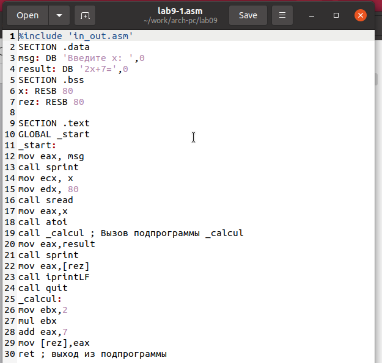{ #fig:001 width=70%, height=70% }

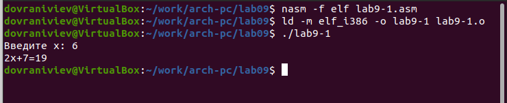{ #fig:002 width=70%, height=70% }

3. Изменил код программы, включив вспомогательную функцию subcalcul в функцию calcul для определения значения составной функции $f(g(x))$, где ввод $x$ происходит с клавиатуры и $f(x) = 2x + 7$, $g(x) = 3x − 1$.

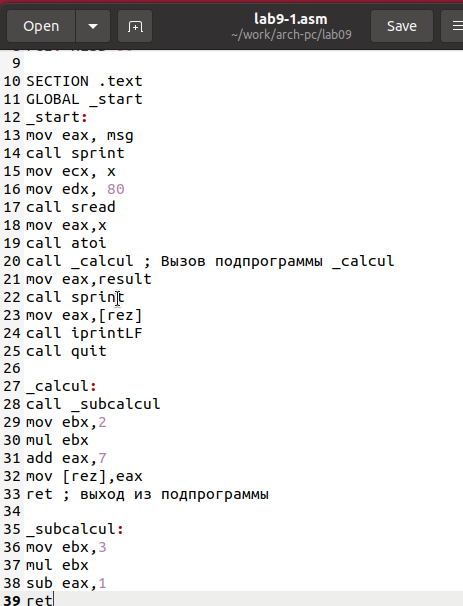{ #fig:003 width=70%, height=70% }

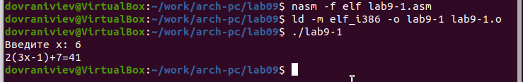{ #fig:004 width=70%, height=70% }

4. Сформировал файл lab9-2.asm, содержащий код программы из Примера 9.2. (Программа выводит на экран сообщение Hello world!).

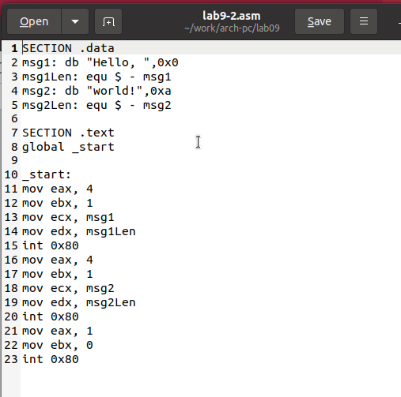{ #fig:005 width=70%, height=70% }

Скомпилировал исходный код в исполняемый файл. Для отладки средствами GDB в исполняемый файл нужно включить отладочную информацию, что достигается компиляцией с опцией ‘-g’.

Запустил исполняемый файл в отладчике gdb.
Проверил функционирование программы, выполнив её в среде GDB с помощью команды run (или r).

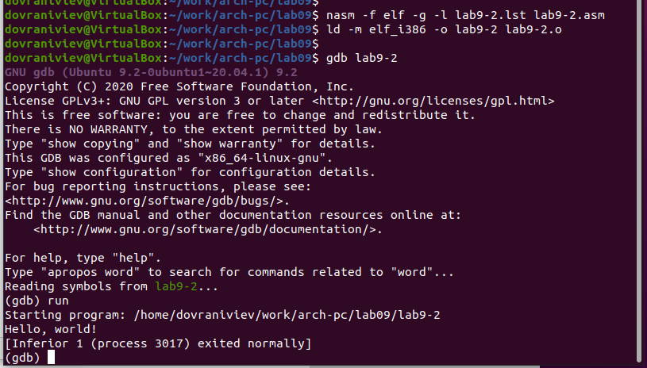{ #fig:006 width=70%, height=70% }

Для более подробного анализа программы установите брейкпоинт на метку
start, с которой начинается выполнение любой ассемблерной программы, и запустите её.
Посмотрите дизассемблированный код программы.

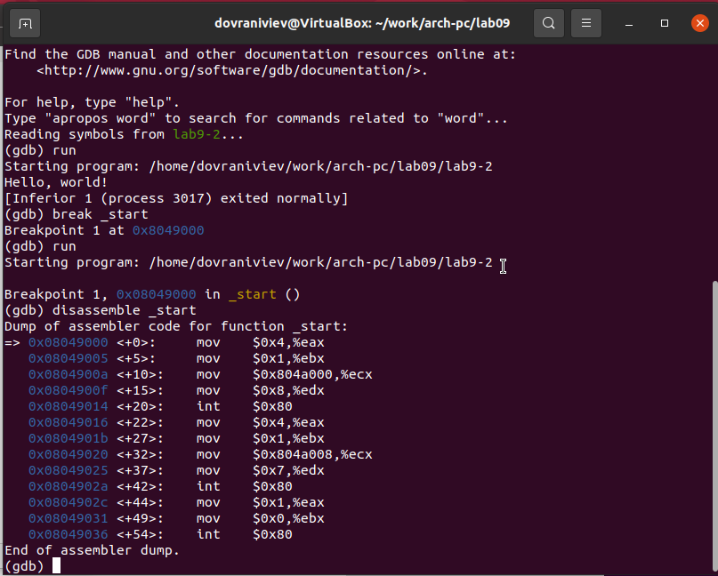{ #fig:007 width=70%, height=70% }

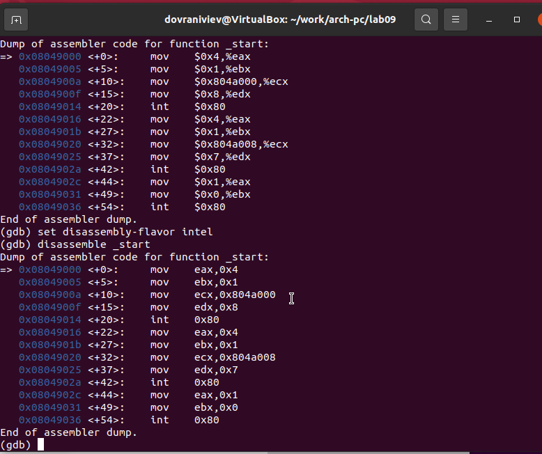{ #fig:008 width=70%, height=70% }

В прошлых этапах была определена точка остановки с именем метки (_start).
Для проверки использовал команду info breakpoints (или сокращенно i b).
Затем задал дополнительную точку остановки на конкретный адрес инструкции.
Чтобы увидеть адрес инструкции, посмотрел на центральную часть экрана, где в левом столбце отображается адрес нужной инструкции. Выбрал адрес для инструкции перед последней (mov ebx,0x0) и установил на нем точку остановки.

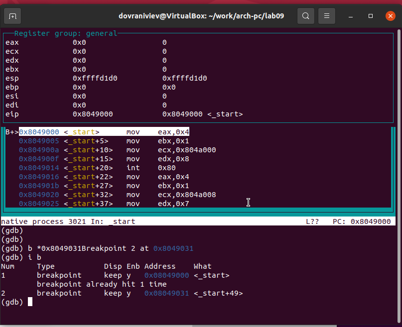{ #fig:009 width=70%, height=70% }

Отладчик предоставляет возможность просмотра содержимого памяти и регистров, а также позволяет ручное редактирование значений регистров и переменных.
С помощью команды stepi (или si) выполнил пять инструкций, следя за изменениями в значениях регистров.

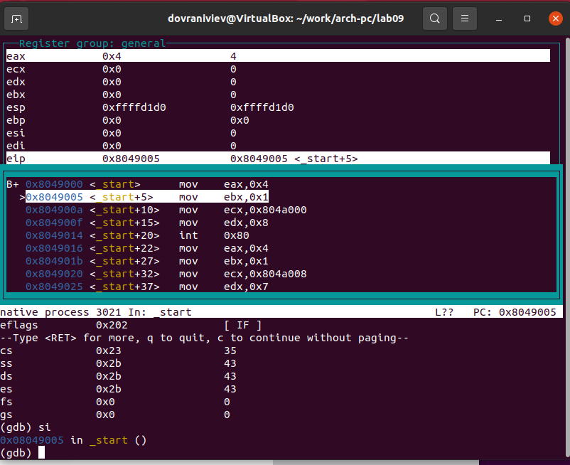{ #fig:010 width=70%, height=70% }

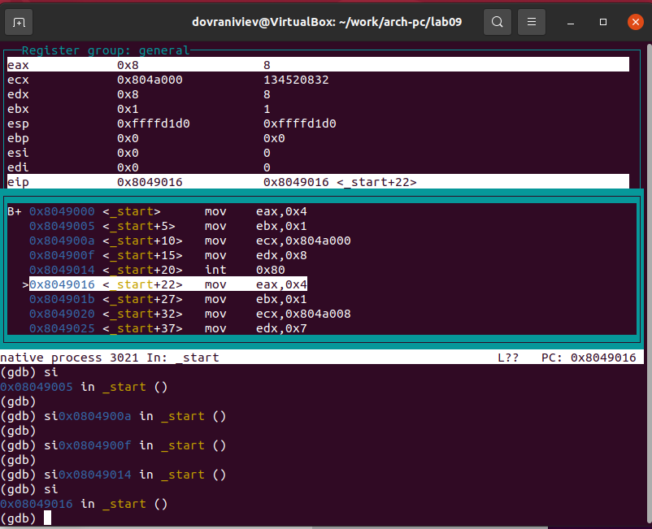{ #fig:011 width=70%, height=70% }

Ознакомился со значением переменной msg1, используя ее имя.
Просмотрел содержимое переменной msg2 по ее адресу.

Для изменения значений регистров или памяти применил команду set, указав в аргументах имя регистра или адрес памяти.
Изменил первый символ в переменной msg1.

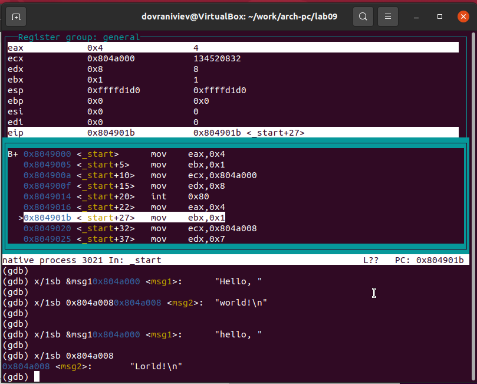{ #fig:012 width=70%, height=70% }

Вывел значение регистра edx в разных форматах: шестнадцатеричном, двоичном и символьном.

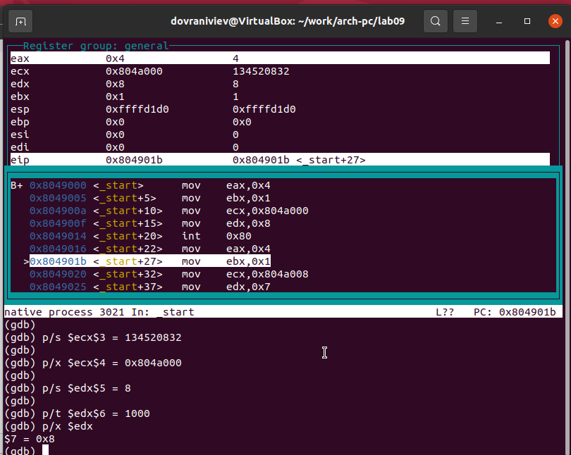{ #fig:013 width=70%, height=70% }

Используя команду set, модифицировал значение в регистре ebx.

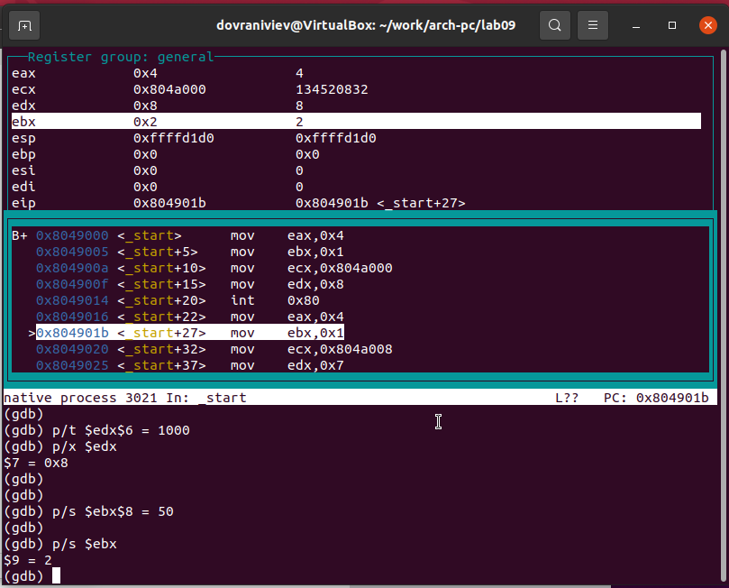{ #fig:014 width=70%, height=70% }

5. Произвел копирование файла lab8-2.asm, который был создан в ходе выполнения лабораторной работы №8 и содержит программу для отображения аргументов командной строки на экране, после чего скомпилировал его в исполняемый файл. Для загрузки исполняемого файла в отладчик gdb с аргументами командной строки применил опцию --args. После этого загрузил программу в отладчик, указав необходимые аргументы.

Установил точку прерывания на начало исполнения программы и начал выполнение. 

Регистр esp содержит адрес вершины стека, где находится количество аргументов командной строки (включая само имя программы). В данном случае обнаружил, что число аргументов составляет 5, включая имя программы lab9-3 и аргументы: аргумент1, аргумент2 и 'аргумент 3'.

Изучил адреса в стеке: по адресу [esp+4] находится указатель на имя программы, по адресу [esp+8] – на первый аргумент, а по адресу [esp+12] – на второй и так далее.

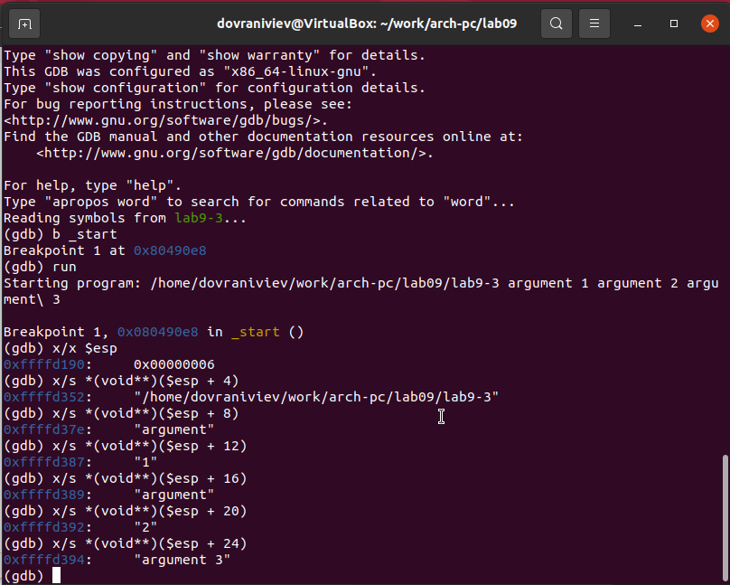{ #fig:015 width=70%, height=70% }

Размер шага изменения адреса ([esp+4], [esp+8], [esp+12]) составляет 4 байта, что соответствует размеру хранящейся переменной.

6. Модифицировал программу из лабораторной работы №8 (самостоятельное задание №1), внедрив функцию вычисления значения функции f(x) в виде отдельной подпрограммы.

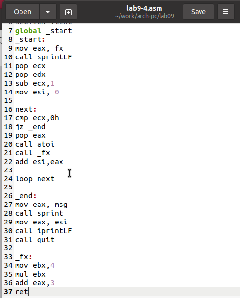{ #fig:016 width=70%, height=70% }

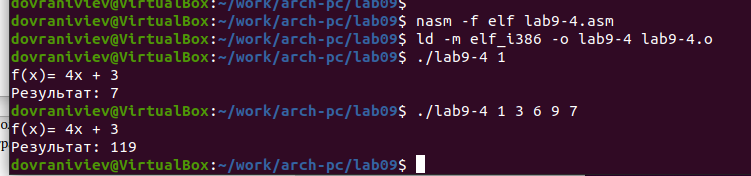{ #fig:017 width=70%, height=70% }

7. В представленном списке команд находится код для расчета выражения $(3+2)*4+5$.
После его выполнения результат оказался некорректным, что я убедился лично.
Используя отладчик GDB и наблюдая за изменениями в регистрах,
я выявлю причину ошибки и внесу соответствующие корректировки.

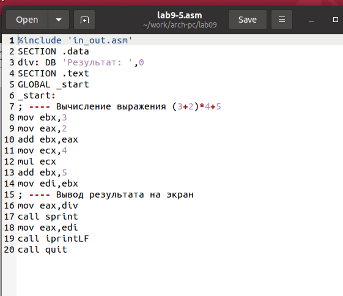{ #fig:018 width=70%, height=70% }

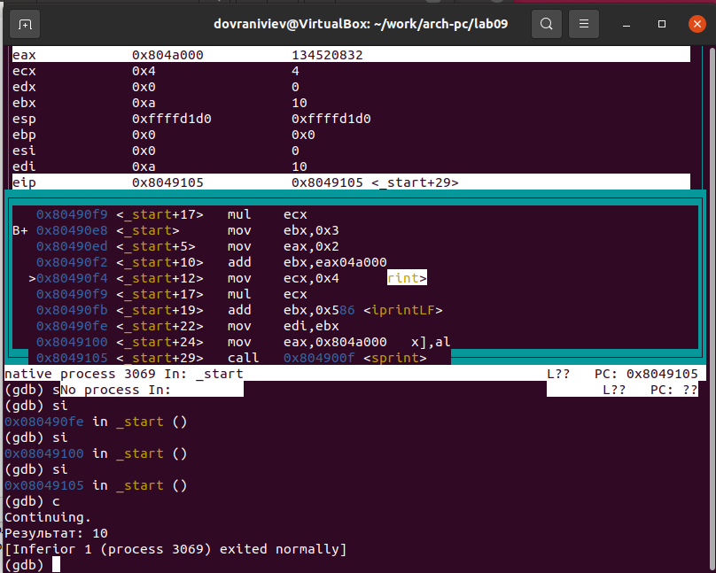{ #fig:019 width=70%, height=70% }

Укажу на то, что был неверно задан порядок операндов в инструкции add, а также на то, что в конце выполнения в регистр edi записывается значение из ebx вместо ожидаемого eax.

Вношу изменения в исходный код программы.

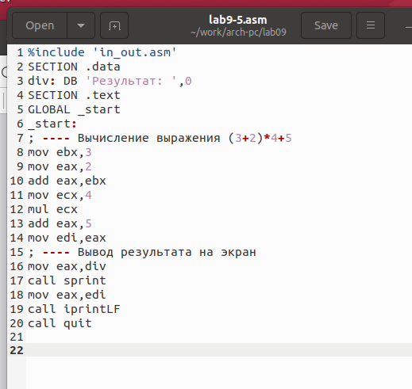{ #fig:020 width=70%, height=70% }

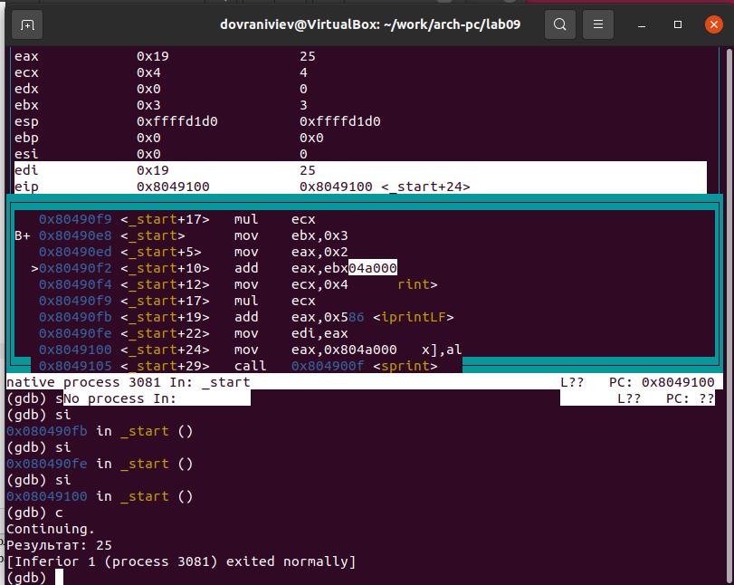{ #fig:021 width=70%, height=70% }

# Выводы

Освоили работy с подпрограммами и отладчиком.