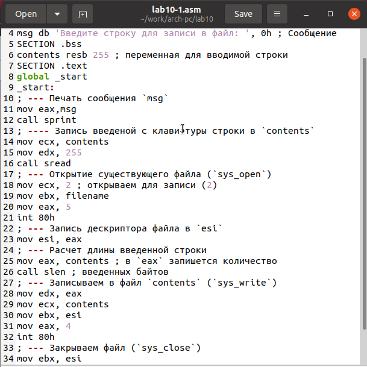
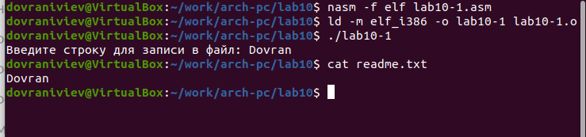
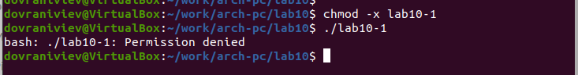
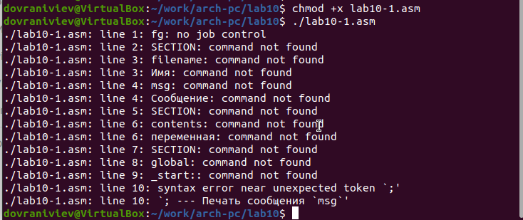
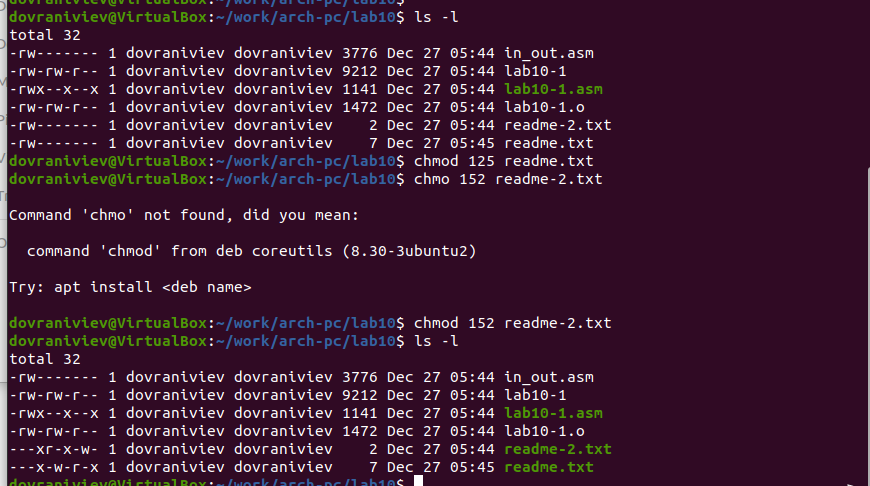
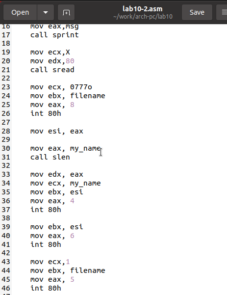
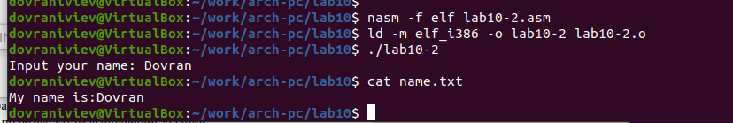

---
## Front matter
title: "Отчёт по лабораторной работе 10"
subtitle: "Архитектура компьютера"
author: "Довран Илиев"

## Generic otions
lang: ru-RU
toc-title: "Содержание"

## Bibliography
bibliography: bib/cite.bib
csl: pandoc/csl/gost-r-7-0-5-2008-numeric.csl

## Pdf output format
toc: true # Table of contents
toc-depth: 2
lof: true # List of figures
lot: true # List of tables
fontsize: 12pt
linestretch: 1.5
papersize: a4
documentclass: scrreprt
## I18n polyglossia
polyglossia-lang:
  name: russian
  options:
	- spelling=modern
	- babelshorthands=true
polyglossia-otherlangs:
  name: english
## I18n babel
babel-lang: russian
babel-otherlangs: english
## Fonts
mainfont: PT Serif
romanfont: PT Serif
sansfont: PT Sans
monofont: PT Mono
mainfontoptions: Ligatures=TeX
romanfontoptions: Ligatures=TeX
sansfontoptions: Ligatures=TeX,Scale=MatchLowercase
monofontoptions: Scale=MatchLowercase,Scale=0.9
## Biblatex
biblatex: true
biblio-style: "gost-numeric"
biblatexoptions:
  - parentracker=true
  - backend=biber
  - hyperref=auto
  - language=auto
  - autolang=other*
  - citestyle=gost-numeric
## Pandoc-crossref LaTeX customization
figureTitle: "Рис."
tableTitle: "Таблица"
listingTitle: "Листинг"
lofTitle: "Список иллюстраций"
lotTitle: "Список таблиц"
lolTitle: "Листинги"
## Misc options
indent: true
header-includes:
  - \usepackage{indentfirst}
  - \usepackage{float} # keep figures where there are in the text
  - \floatplacement{figure}{H} # keep figures where there are in the text
---

# Цель работы

Целью работы является приобретение навыков написания программ для работы с файлами.

# Выполнение лабораторной работы

1. Создание папки для работы с лабораторной № 10, вход в созданную папку и инициализация файлов lab10-1.asm, readme-1.txt и readme-2.txt.

2. Процесс записи кода программы в файл lab10-1.asm из примера 10.1, который относится к записи сообщений в файл. Компиляция в исполняемый файл и проверка его функционирования.

{ #fig:001 width=70%, height=70% }

{ #fig:002 width=70%, height=70% }

3. Изменение прав доступа к файлу lab10-1, который является исполняемым, с помощью команды chmod, установив запрет на его выполнение. Попытка запуска файла приводит к неудаче, так как отсутствует разрешение на выполнение.

{ #fig:003 width=70%, height=70% }

4. Использование команды chmod для изменения прав доступа на файл с исходным кодом lab10-1.asm, предоставляя ему права на выполнение. Попытка исполнения файла приводит к тому, что терминал пытается интерпретировать его содержимое как команды оболочки, что ведет к ошибкам, так как код ассемблера не является командами оболочки. Однако, если в файле будут команды оболочки, то они будут выполнены при запуске файла.

{ #fig:004 width=70%, height=70% }

5. Предоставил права доступа к файлам readme в соответствии с вариантом в таблице 10.4. 
Проверил правильность выполнения с помощью команды ls -l.

для варианта 5: ```--x -w- r-x ``` и ```001 101 010```

{ #fig:005 width=70%, height=70% }

6. Написал программу работающую по следующему алгоритму:

* Вывод приглашения “Как Вас зовут?”

* ввести с клавиатуры свои фамилию и имя

* создать файл с именем name.txt

* записать в файл сообщение “Меня зовут”

* дописать в файл строку введенную с клавиатуры

* закрыть файл

{ #fig:006 width=70%, height=70% }

{ #fig:007 width=70%, height=70% }

# Выводы

Освоили работy с файлами и правами доступа.